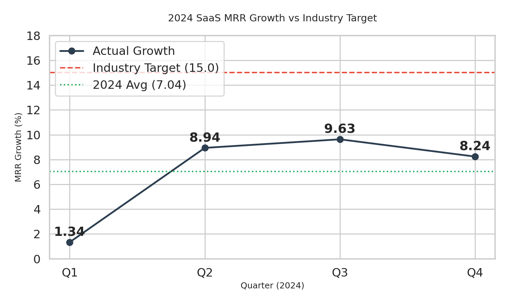

# SaaS Technology Performance Analysis: MRR Growth 2024

**Analyst Contact:** 23f2001849@ds.study.iitm.ac.in  
**Date:** 2024-12-10

## 1. Executive Summary
The executive team has identified a critical gap in our revenue velocity. While 2024 showed recovery after Q1, our annual average Monthly Recurring Revenue (MRR) growth remains significantly below the industry benchmark. This analysis outlines the performance trends and recommends a strategic pivot to close this gap in the upcoming fiscal year.

## 2. Data Analysis
We analyzed the quarterly MRR growth rates for the fiscal year 2024 against the industry target of 15%.

| Quarter | MRR Growth (%) |
| :--- | :--- |
| Q1 | 1.34 |
| Q2 | 8.94 |
| Q3 | 9.63 |
| Q4 | 8.24 |
| **Average** | **7.04** |
| **Target** | **15.00** |

### Key Findings
* **Performance Gap:** The calculated average MRR growth for 2024 is **7.04**, which is less than half of the industry target (15).
* **Volatility:** Q1 was a significant outlier (1.34), dragging down the annual average.
* **Stagnation:** While Q2 and Q3 showed recovery, growth plateaued and slightly dipped in Q4 (8.24), indicating market saturation in our current segments.

## 3. Business Implications
The current trend poses risks to our series valuation and resource allocation efficiency. Continuing at a ~7% growth rate will result in losing market share to competitors who are scaling at the 15%+ benchmark. The stagnation in Q4 suggests that our existing customer base is fully penetrated, and upsell opportunities are diminishing.

## 4. Strategic Recommendations
To bridge the gap between our current 7.04% growth and the 15% target, we must look beyond our current demographics.

**Primary Solution:**
**Expand into new market segments.**

Moving into adjacent vertical markets will unlock fresh customer acquisition channels, reducing our dependency on the saturated existing base and driving the high-velocity growth needed to meet the 15% benchmark.